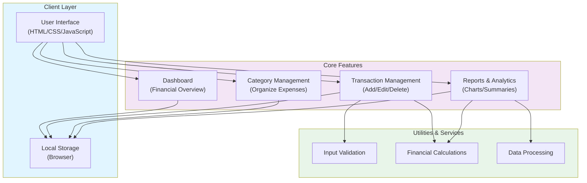

# Budget Tracker - Architecture Overview

## System Architecture

This document provides an overview of the Budget Tracker application architecture.

## Component Description

### Client Layer
- **User Interface**: HTML-based frontend providing interactive interface for budget tracking
- **Local Storage**: Browser-based storage for persisting financial data

### Core Features
- **Dashboard**: Main interface displaying financial overview and key metrics
- **Transaction Management**: Functionality to add, view, edit, and delete financial transactions
- **Category Management**: Organization of expenses into categories for better tracking
- **Reports & Analytics**: Generation of reports and visual analytics of spending patterns

### Utilities & Services
- **Input Validation**: Ensures data integrity and handles user inputs
- **Financial Calculations**: Performs calculations for totals, averages, and summaries
- **Data Processing**: Processes and transforms financial data for reporting

## Data Flow

1. User interacts with the UI
2. Input is validated through validation utilities
3. Data is processed and stored in local storage
4. Dashboard and reports retrieve and display data from storage
5. Calculations and analytics are performed on stored data

## Technologies

- **Frontend**: HTML, CSS, JavaScript
- **Storage**: Browser Local Storage API
- **Visualization**: Chart generation for financial reports
